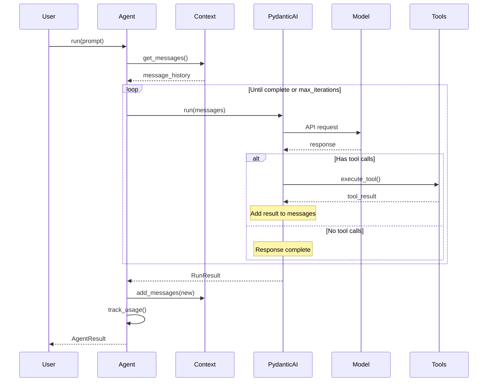
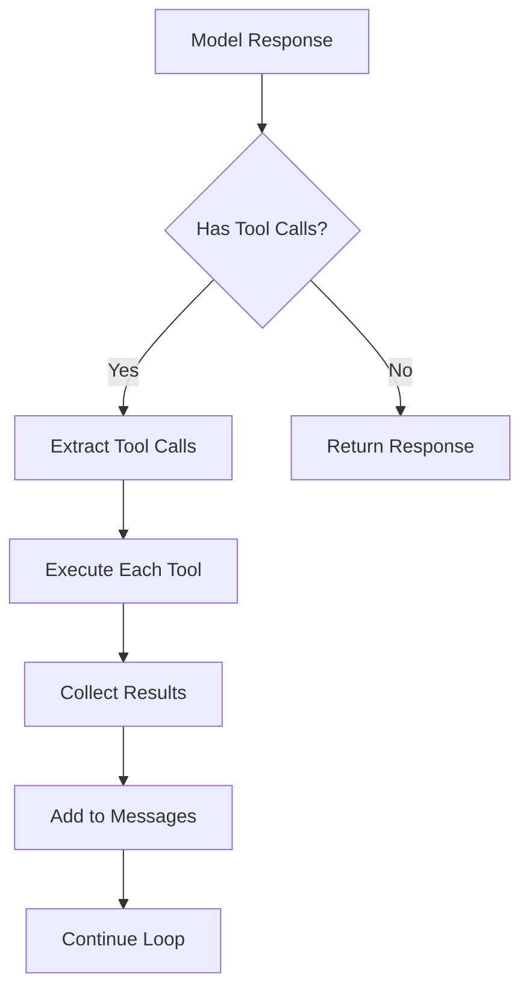

# Agent Execution Loop

Understanding how agents process messages, call tools, and manage state.

## Overview

The agent execution loop handles:

1. Message preparation (context + new prompt)
2. Model inference (via pydantic-ai)
3. Tool execution (if requested)
4. Response processing
5. State updates (context, usage tracking)

## Basic Execution Flow



## Iteration Behavior

### Tool Calling Loop

When the model requests tools, execution continues:

```python
# Simplified execution logic
for iteration in range(max_iterations):
    response = await model.complete(messages)

    if response.has_tool_calls:
        for tool_call in response.tool_calls:
            result = await execute_tool(tool_call)
            messages.append(tool_result_message(result))
    else:
        # No more tool calls, done
        return response.content
```

### Max Iterations

Prevents infinite loops:

```python
config = AgentConfig(max_iterations=10)  # Default

# If reached:
# - Execution stops
# - Current response returned
# - Warning logged
```

## Context Integration

### Message History

Context is automatically included:

```python
# Before each run
messages = [
    system_prompt,
    *context_manager.get_messages(),  # History
    new_user_message,                   # Current prompt
]
```

### After Execution

New messages are added:

```python
# After run completes
context_manager.add_messages([
    user_message,
    assistant_response,
    *tool_messages,  # If any
])
```

## Token Tracking

### Per-Request Tracking

```python
# After each model call
usage_tracker.record_usage(
    prompt_tokens=response.usage.prompt_tokens,
    completion_tokens=response.usage.completion_tokens,
    model=model_name,
)
```

### Aggregate Access

```python
# Available after run
usage = agent.get_usage()      # TokenUsage
cost = agent.get_cost()        # float
history = agent.get_usage_history()  # list[UsageRecord]
```

## Auto-Compaction

### Threshold Check

```python
# After adding messages
if config.auto_compact and context_manager.should_compact():
    await context_manager.compact()
```

### Compaction Triggers

```python
# should_compact() returns True when:
current_tokens = context_manager.get_token_count()
threshold = config.context.trigger_threshold_tokens

should_compact = current_tokens >= threshold
```

## Execution Methods

### Synchronous

```python
result = agent.run_sync(prompt)
# Blocks until complete
```

### Asynchronous

```python
result = await agent.run(prompt)
# Non-blocking, use in async context
```

### Streaming

```python
async for chunk in agent.run_stream(prompt):
    print(chunk, end="")
# Yields response incrementally
```

## Tool Execution

### Tool Discovery

Tools are registered at agent creation:

```python
agent = Agent("gpt-4o", tools=[read_file, run_bash])
# Tools are available to pydantic-ai
```

### Tool Call Flow



### Error Handling

```python
# Tool errors don't stop execution
try:
    result = await tool.execute(args)
    return ToolResult(success=True, content=result)
except Exception as e:
    return ToolResult(success=False, error=str(e))
# Model receives error and can retry or adjust
```

## State Management

### Context State

```python
state = agent.get_context_state()
# ContextState(
#     token_count=1500,
#     message_count=12,
#     system_prompt="...",
#     compaction_history=[...]
# )
```

### Usage State

```python
usage = agent.get_usage()
# TokenUsage(
#     prompt_tokens=1000,
#     completion_tokens=500,
#     total_tokens=1500,
#     request_count=3
# )
```

### Reset Operations

```python
# Clear context only
agent.clear_context()

# Reset usage tracking only
agent.reset_tracking()

# Reset everything
agent.reset_all()
```

## Multi-Turn Conversations

### Automatic Context

```python
# Turn 1
agent.run_sync("My name is Alice")

# Turn 2 - context includes Turn 1
result = agent.run_sync("What's my name?")
# Agent remembers "Alice"
```

### Manual Context Control

```python
# Start fresh conversation
agent.clear_context()

# Or with custom history
messages = [...]
agent.context_manager.add_messages(messages)
```

## Performance Considerations

### Token Efficiency

- Context grows with each turn
- Auto-compaction prevents overflow
- Choose appropriate compaction strategy

### Latency

- Each iteration adds latency
- Tool execution time varies
- Consider timeouts for long operations

### Cost

- More tokens = higher cost
- Tool calls add iterations
- Monitor with `agent.get_cost()`

## Debugging

### Enable Debug Logging

```python
import logging
logging.basicConfig(level=logging.DEBUG)

# Shows detailed execution flow
```

### Inspect Messages

```python
# After a run
messages = agent.get_messages()
for msg in messages:
    print(f"{msg['role']}: {msg['content'][:100]}...")
```

### Track Iterations

```python
# Via hooks in workflows
def on_iteration(state, i):
    print(f"Iteration {i}")

hooks = WorkflowHooks(on_iteration_start=on_iteration)
```
