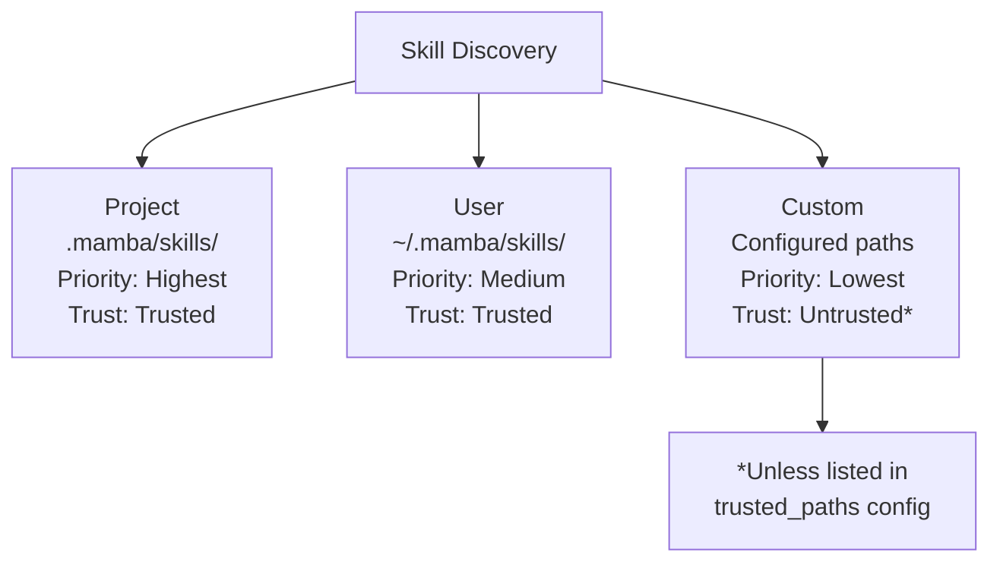
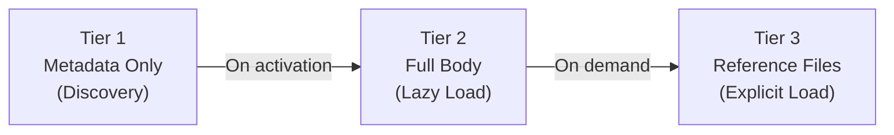

<!-- docs/user-guide/skills.md -->
# Skills

!!! warning "Experimental"
    The skills subsystem is **experimental**. The public API may change in minor versions. Pin your dependency version if you rely on skills in production.

Skills are modular, discoverable, reusable agent capabilities defined as SKILL.md files. Each skill is a markdown document with YAML frontmatter containing metadata and a markdown body with instructions. Skills follow the [SKILL.md open standard](https://github.com/anthropics/agent-skills) and support progressive loading, trust-based access control, and argument substitution.

## Overview

The skills system provides:

- **Modular capabilities** -- Package agent instructions as self-contained, shareable units
- **Progressive disclosure** -- Metadata loads eagerly at discovery; body loads lazily on activation
- **Trust-based access control** -- Project and user skills are trusted by default; custom paths are untrusted
- **Automatic discovery** -- Skills are found in standard directories without manual registration
- **Argument substitution** -- Pass runtime values into skill content via placeholder syntax
- **Fork execution** -- Delegate skill activation to a subagent for isolated execution

## Quick Start

### Creating a Skill

Create a directory with a `SKILL.md` file inside your project's `.mamba/skills/` directory:

```
.mamba/skills/
  code-reviewer/
    SKILL.md
```

``` markdown title=".mamba/skills/code-reviewer/SKILL.md"
---
name: code-reviewer
description: Reviews code for best practices, bugs, and style issues
allowed-tools:
  - read_file
  - grep_search
argument-hint: "<file-path>"
---

You are a code reviewer. Review the file at $ARGUMENTS for:

1. Potential bugs or logic errors
2. Style and naming conventions
3. Performance concerns
4. Security issues

Provide specific, actionable feedback with line references.
```

### Using a Skill with an Agent

```python
from mamba_agents import Agent

# Register skills at creation
agent = Agent("gpt-4o", skills=[".mamba/skills/code-reviewer"])

# Or discover skills automatically from default directories
agent = Agent("gpt-4o", skill_dirs=[".mamba/skills"])

# Invoke the skill
content = agent.invoke_skill("code-reviewer", "src/auth/middleware.py")
print(content)
```

### Registering Skills After Creation

```python
from pathlib import Path

agent = Agent("gpt-4o")

# Register by path (string or Path)
agent.register_skill(".mamba/skills/code-reviewer")
agent.register_skill(Path(".mamba/skills/code-reviewer"))

# List registered skills
for skill_info in agent.list_skills():
    print(f"{skill_info.name}: {skill_info.description}")

# Get full skill details
skill = agent.get_skill("code-reviewer")
print(skill.body)
```

## SKILL.md File Format

Every skill is defined in a `SKILL.md` file using YAML frontmatter followed by a markdown body.

### Frontmatter Fields

| Field | Type | Required | Default | Description |
|-------|------|----------|---------|-------------|
| `name` | string | Yes | -- | Unique identifier. Lowercase alphanumeric and hyphens, max 64 chars. Must match parent directory name. |
| `description` | string | Yes | -- | Human-readable description of the skill's purpose. |
| `license` | string | No | `None` | SPDX license identifier (e.g., `MIT`, `Apache-2.0`). |
| `compatibility` | string | No | `None` | Version or tool compatibility string. |
| `metadata` | mapping | No | `None` | Arbitrary key-value metadata. |
| `allowed-tools` | list | No | `None` | Tool names this skill is permitted to use. |
| `model` | string | No | `None` | Model override for skill execution. |
| `context` | string | No | `None` | Execution mode. Set to `"fork"` to delegate to a subagent. |
| `agent` | string | No | `None` | Named subagent config for fork mode. |
| `disable-model-invocation` | bool | No | `false` | Block the LLM from invoking this skill. |
| `user-invocable` | bool | No | `true` | Whether users can invoke this skill directly. |
| `argument-hint` | string | No | `None` | Hint text describing expected arguments. |
| `hooks` | mapping | No | `None` | Reserved for future lifecycle hooks (not implemented). |

### Complete Example

``` markdown title=".mamba/skills/data-analyzer/SKILL.md"
---
name: data-analyzer
description: Analyzes CSV data files and produces summary statistics
license: MIT
compatibility: ">=1.0"
metadata:
  author: data-team
  category: analytics
allowed-tools:
  - read_file
  - run_bash
model: gpt-4o
user-invocable: true
argument-hint: "<csv-file> [columns...]"
---

You are a data analysis specialist. Analyze the CSV file at $ARGUMENTS[0].

## Steps

1. Read the file using `read_file`
2. Examine the column structure
3. Compute summary statistics for each numeric column
4. Identify outliers and missing values
5. Present findings in a markdown table

If specific columns are requested ($ARGUMENTS[1] and beyond), focus your
analysis on those columns only.
```

### Name Validation Rules

The `name` field must:

- Contain only lowercase letters, digits, and hyphens (`a-z`, `0-9`, `-`)
- Not start or end with a hyphen
- Be at most 64 characters long
- Match the parent directory name exactly

!!! example "Valid and Invalid Names"
    **Valid:** `code-reviewer`, `data-analyzer`, `my-tool-v2`

    **Invalid:** `Code-Reviewer` (uppercase), `-my-skill` (leading hyphen), `my skill` (space)

## Directory Structure and Discovery

Skills are discovered from three directory scopes, listed in priority order:



### Project Scope (Highest Priority)

```
your-project/
  .mamba/
    skills/
      code-reviewer/
        SKILL.md
        references/          # Optional: Tier 3 reference files
          style-guide.md
          api-docs.md
      data-analyzer/
        SKILL.md
```

Project skills live in `.mamba/skills/` relative to the working directory. They are always **trusted** and take precedence over skills with the same name in other scopes.

### User Scope (Medium Priority)

```
~/.mamba/
  skills/
    shared-formatter/
      SKILL.md
    personal-tool/
      SKILL.md
```

User skills live in `~/.mamba/skills/` and are shared across all your projects. They are **trusted** by default.

### Custom Scope (Lowest Priority)

Custom paths are additional directories configured via `SkillConfig.custom_paths`. They default to **untrusted** unless explicitly listed in `SkillConfig.trusted_paths`.

### Name Conflict Resolution

When the same skill name appears in multiple scopes, the higher-priority scope wins:

- **Same scope:** Raises `SkillConflictError` (two skills named `code-reviewer` in `.mamba/skills/` is an error)
- **Cross scope:** Higher priority wins silently (project overrides user, user overrides custom)

## Trust Model

Trust levels control what capabilities a skill can use:

| Capability | Trusted | Untrusted |
|------------|---------|-----------|
| Standard activation | Yes | Yes |
| Allowed tools | Yes | No |
| Fork execution mode | Yes | No |
| Hooks (reserved) | Yes | No |

### Default Trust Assignments

| Scope | Default Trust |
|-------|---------------|
| Project (`.mamba/skills/`) | `TRUSTED` |
| User (`~/.mamba/skills/`) | `TRUSTED` |
| Custom paths | `UNTRUSTED` |

### Trusting Custom Paths

```python
from pathlib import Path
from mamba_agents.skills import SkillConfig

config = SkillConfig(
    custom_paths=[Path("/shared/team-skills")],
    trusted_paths=[Path("/shared/team-skills")],  # Promote to trusted
)
```

!!! warning
    Only add paths you control to `trusted_paths`. Trusted skills can register tools and delegate to subagents.

## Invocation Sources

Skills can be invoked from three sources, each with independent permission gates:

| Source | Enum | Description | Permission Flag |
|--------|------|-------------|-----------------|
| Model | `InvocationSource.MODEL` | LLM invokes during conversation | Blocked by `disable-model-invocation: true` |
| User | `InvocationSource.USER` | User invokes directly (e.g., slash command) | Blocked by `user-invocable: false` |
| Code | `InvocationSource.CODE` | Programmatic invocation from application code | Always permitted |

!!! tip
    Use `disable-model-invocation: true` for skills that should only be triggered explicitly by users or code, never autonomously by the model.

## Argument Substitution

Skills support three placeholder syntaxes for injecting runtime arguments into the skill body.

### Placeholder Syntax

| Placeholder | Description | Example Input | Result |
|-------------|-------------|---------------|--------|
| `$ARGUMENTS` | Full argument string | `"file.txt --verbose"` | `file.txt --verbose` |
| `$ARGUMENTS[N]` | Positional argument (0-indexed) | `"file.txt report"` | `$ARGUMENTS[0]` = `file.txt` |
| `$N` | Shorthand for positional | `"file.txt report"` | `$0` = `file.txt`, `$1` = `report` |

### Substitution Rules

1. `$ARGUMENTS[N]` is replaced first (avoids partial matches with `$ARGUMENTS`)
2. `$ARGUMENTS` is replaced with the full argument string
3. `$N` positional shorthands are replaced
4. If **no placeholders** are found in the body, arguments are appended as `ARGUMENTS: <value>`
5. Missing positional arguments resolve to empty strings

### Example

Given this skill body:

```markdown
Analyze $ARGUMENTS[0] and compare with $ARGUMENTS[1].
Full request: $ARGUMENTS
```

Invoking with `agent.invoke_skill("my-skill", "data.csv", "baseline.csv")` produces:

```
Analyze data.csv and compare with baseline.csv.
Full request: data.csv baseline.csv
```

!!! note
    Arguments are parsed using shell-like splitting. Use quotes to pass arguments containing spaces: `agent.invoke_skill("my-skill", '"hello world"', "other")`.

## Progressive Disclosure

Skills use a three-tier loading strategy to minimize startup cost:



| Tier | What Loads | When | API |
|------|-----------|------|-----|
| **Tier 1** | YAML frontmatter only | At discovery / registration | `SkillInfo` |
| **Tier 2** | Frontmatter + markdown body | First activation (lazy) | `Skill` |
| **Tier 3** | Supplemental reference files | Explicit request only | `get_references()`, `load_reference()` |

### Working with Reference Files

Reference files live in a `references/` subdirectory within the skill:

```
my-skill/
  SKILL.md
  references/
    api-docs.md
    style-guide.md
    examples.json
```

```python
# List available references
refs = agent.skill_manager.get_references("my-skill")
for ref_path in refs:
    print(ref_path.name)

# Load a specific reference
content = agent.skill_manager.load_reference("my-skill", "api-docs.md")
```

## Configuration

### SkillConfig Reference

```python
from pathlib import Path
from mamba_agents.skills import SkillConfig

config = SkillConfig(
    skills_dirs=[Path(".mamba/skills")],          # Project skill directories
    user_skills_dir=Path("~/.mamba/skills"),       # User-level directory
    custom_paths=[Path("/shared/team-skills")],    # Additional search paths
    auto_discover=True,                            # Auto-discover on startup
    namespace_tools=True,                          # Prefix tools with skill name
    trusted_paths=[Path("/shared/team-skills")],   # Paths to treat as trusted
)
```

| Option | Type | Default | Description |
|--------|------|---------|-------------|
| `skills_dirs` | `list[Path]` | `[Path(".mamba/skills")]` | Project-level skill directories |
| `user_skills_dir` | `Path` | `Path("~/.mamba/skills")` | User-level skill directory (`~` is expanded) |
| `custom_paths` | `list[Path]` | `[]` | Additional search paths |
| `auto_discover` | `bool` | `True` | Auto-discover skills on startup |
| `namespace_tools` | `bool` | `True` | Prefix tools with `{skill_name}:` |
| `trusted_paths` | `list[Path]` | `[]` | Custom paths promoted to trusted |

### Environment Variables

Configure skills via environment variables with the `MAMBA_SKILLS__` prefix:

```bash
MAMBA_SKILLS__AUTO_DISCOVER=true
MAMBA_SKILLS__NAMESPACE_TOOLS=true
```

### Providing Config to the Agent

=== "Via AgentSettings"

    ```python
    from mamba_agents import Agent, AgentSettings
    from mamba_agents.skills import SkillConfig

    settings = AgentSettings(
        skills=SkillConfig(
            custom_paths=[Path("/shared/skills")],
            trusted_paths=[Path("/shared/skills")],
        ),
    )

    agent = Agent("gpt-4o", settings=settings)
    ```

=== "Direct Registration"

    ```python
    from mamba_agents import Agent

    agent = Agent(
        "gpt-4o",
        skills=[".mamba/skills/code-reviewer"],
        skill_dirs=[".mamba/skills"],
    )
    ```

## Standalone SkillManager

For advanced use cases, you can use `SkillManager` directly without an Agent:

```python
from pathlib import Path
from mamba_agents.skills import SkillManager, SkillConfig

# Create with custom configuration
manager = SkillManager(config=SkillConfig(
    custom_paths=[Path("/shared/skills")],
))

# Discover skills from all configured directories
discovered = manager.discover()
print(f"Found {len(discovered)} skills")

# Register a skill manually
manager.register(Path(".mamba/skills/my-skill"))

# List all registered skills
for info in manager.list():
    print(f"  {info.name} ({info.scope.value}, {info.trust_level.value})")

# Activate a skill with arguments
content = manager.activate("my-skill", arguments="file.txt")

# Deactivate when done
manager.deactivate("my-skill")

# Validate a skill file
result = manager.validate(Path(".mamba/skills/my-skill"))
if not result.valid:
    for error in result.errors:
        print(f"  Error: {error}")

# Access tools from active skills
tools = manager.get_all_tools()

# Work with reference files (Tier 3)
refs = manager.get_references("my-skill")
ref_content = manager.load_reference("my-skill", "api-docs.md")
```

## Fork Execution Mode

Skills with `context: fork` delegate their execution to a subagent instead of returning content directly. This provides isolated execution with its own context window and tool set.

### Named Subagent Fork

Reference an existing subagent configuration by name:

``` markdown title=".mamba/skills/research-task/SKILL.md"
---
name: research-task
description: Delegates research tasks to a specialized subagent
context: fork
agent: researcher
argument-hint: "<topic>"
---

Research the following topic thoroughly: $ARGUMENTS

Provide a comprehensive summary with sources.
```

The `agent: researcher` field references a subagent config registered with the `SubagentManager`. See [Subagents](subagents.md) for how to define subagent configurations.

### Unnamed Fork (Dynamic Subagent)

Omit the `agent` field to create a temporary subagent on the fly:

``` markdown title=".mamba/skills/quick-task/SKILL.md"
---
name: quick-task
description: Runs a one-off task in an isolated subagent
context: fork
---

Complete this task: $ARGUMENTS
```

### Fork Restrictions

!!! danger "Trust Required"
    Only **trusted** skills can use fork execution mode. Untrusted skills with `context: fork` will raise a `SkillInvocationError` at activation.

The system also detects circular references (skill -> subagent -> pre-loaded skill -> subagent -> ...) and raises `SkillInvocationError` if a cycle is found.

## Testing Skills

The `SkillTestHarness` lets you test skills in isolation without a full Agent instance or real LLM model.

### Direct Usage

```python
from pathlib import Path
from mamba_agents.skills.testing import SkillTestHarness

harness = SkillTestHarness(skill_path=Path(".mamba/skills/code-reviewer"))

# Load the skill
skill = harness.load()
print(f"Name: {skill.info.name}")
print(f"Description: {skill.info.description}")

# Validate the SKILL.md file
result = harness.validate()
assert result.valid, f"Validation errors: {result.errors}"

# Simulate invocation with test arguments
content = harness.invoke("src/main.py")
assert "$ARGUMENTS" not in content  # Placeholders should be substituted
assert "src/main.py" in content

# Check which tools the skill declares
tools = harness.get_registered_tools()
print(f"Allowed tools: {tools}")
```

### Pytest Fixture

The `skill_harness` fixture provides a convenient factory for test functions:

```python
from pathlib import Path

def test_skill_is_valid(skill_harness):
    harness = skill_harness(path=Path(".mamba/skills/code-reviewer"))
    result = harness.validate()
    assert result.valid

def test_skill_substitutes_arguments(skill_harness):
    harness = skill_harness(path=Path(".mamba/skills/code-reviewer"))
    content = harness.invoke("my-file.py")
    assert "my-file.py" in content
    assert "$ARGUMENTS" not in content

def test_skill_declares_tools(skill_harness):
    harness = skill_harness(path=Path(".mamba/skills/code-reviewer"))
    tools = harness.get_registered_tools()
    assert "read_file" in tools
```

!!! tip
    Register the `skill_harness` fixture in your `conftest.py` if you are not using `mamba_agents.skills.testing` as a pytest plugin:

    ```python title="conftest.py"
    from mamba_agents.skills.testing import skill_harness  # noqa: F401
    ```

## Error Handling

All skill exceptions inherit from `SkillError`, so you can catch them broadly or handle specific cases:

```python
from mamba_agents.skills.errors import (
    SkillError,
    SkillNotFoundError,
    SkillParseError,
    SkillValidationError,
    SkillLoadError,
    SkillConflictError,
    SkillInvocationError,
)

try:
    agent.invoke_skill("my-skill", "args")
except SkillNotFoundError as e:
    print(f"Skill '{e.name}' not found at {e.path}")
except SkillValidationError as e:
    print(f"Validation failed for '{e.name}': {e.errors}")
except SkillInvocationError as e:
    print(f"Cannot invoke '{e.name}' from '{e.source}': {e.reason}")
except SkillError as e:
    print(f"Skill error: {e.message}")
```

### Error Reference

| Exception | When Raised | Key Attributes |
|-----------|-------------|----------------|
| `SkillError` | Base class for all skill errors | `message` |
| `SkillNotFoundError` | Skill path does not exist | `name`, `path` |
| `SkillParseError` | YAML frontmatter syntax error | `name`, `path`, `detail` |
| `SkillValidationError` | Required fields missing or name invalid | `name`, `errors`, `path` |
| `SkillLoadError` | Permission denied or IO error | `name`, `path`, `cause` |
| `SkillConflictError` | Duplicate names in the same scope | `name`, `paths` |
| `SkillInvocationError` | Permission denied, circular ref, or fork failure | `name`, `source`, `reason` |

## Lazy Initialization Caveat

!!! warning "Property Side Effect"
    Accessing `agent.skill_manager` **creates** the `SkillManager` on first access, not just retrieves it. This means conditional checks like `if agent.skill_manager:` will unexpectedly initialize the subsystem.

    To check whether the skill manager has been initialized without triggering creation:

    ```python
    # Correct: check the private attribute
    if agent._skill_manager is not None:
        # Skill manager already exists
        ...

    # Incorrect: this creates the manager as a side effect
    if agent.skill_manager:
        ...
    ```

## Agent Facade Methods

The `Agent` class provides convenience methods that delegate to the underlying `SkillManager`:

| Method | Description |
|--------|-------------|
| `agent.skill_manager` | Property that returns (or lazily creates) the `SkillManager` |
| `agent.register_skill(skill)` | Register a `Skill`, `SkillInfo`, string path, or `Path` |
| `agent.get_skill(name)` | Get a `Skill` by name, or `None` |
| `agent.list_skills()` | List all registered `SkillInfo` objects |
| `agent.invoke_skill(name, *args)` | Activate a skill with positional arguments joined by spaces |

## Next Steps

- [Subagents](subagents.md) -- Learn about subagent delegation and how fork-mode skills integrate
- [Working with Tools](tools.md) -- Built-in tools that skills can reference via `allowed-tools`
- [Error Handling](error-handling.md) -- Broader error handling patterns in Mamba Agents
