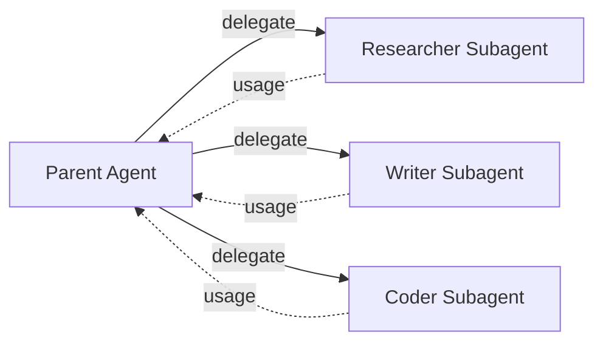
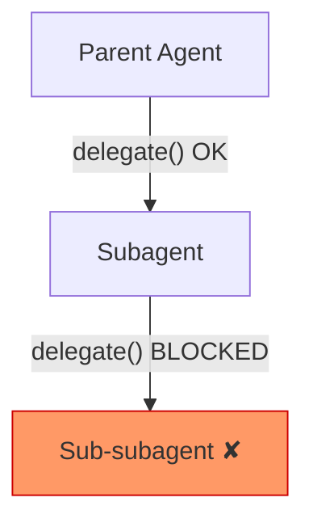

<!-- docs/user-guide/subagents.md -->
# Subagents

!!! warning "Experimental"
    The subagents subsystem is **experimental**. The public API may change in minor versions. Use in production at your own discretion.

Subagents enable isolated task delegation to child Agent instances. Each subagent gets its own `ContextManager`, `UsageTracker`, and other subsystems — complete isolation from the parent agent. Token usage flows back to the parent automatically.

## Overview

The subagents system provides:

- **Task delegation** — Offload specific tasks to purpose-built child agents
- **Complete isolation** — Each subagent has its own context, usage tracking, and configuration
- **Three delegation patterns** — Synchronous, asynchronous, and fire-and-forget
- **Token usage aggregation** — Subagent token costs roll up to the parent automatically
- **Config-file discovery** — Define subagents as markdown files in `.mamba/agents/`
- **Skill pre-loading** — Subagents can include skills in their system prompt
- **No-nesting rule** — Subagents cannot spawn sub-subagents, preventing unbounded recursion



## Quick Start

```python
from mamba_agents import Agent
from mamba_agents.subagents import SubagentConfig

# Create an agent with subagents
agent = Agent(
    "gpt-4o",
    subagents=[
        SubagentConfig(
            name="researcher",
            description="Research subagent for gathering information",
            model="gpt-4o-mini",
            tools=["read_file", "grep_search"],
            system_prompt="You are a research assistant.",
        ),
    ],
)

# Delegate a task
result = agent.delegate_sync("researcher", "Find information about Python asyncio")
print(result.output)
```

## Registering Subagents

Subagents can be registered at agent creation or added later at runtime.

### At Creation

```python
from mamba_agents import Agent
from mamba_agents.subagents import SubagentConfig

agent = Agent(
    "gpt-4o",
    subagents=[
        SubagentConfig(
            name="researcher",
            description="Research subagent for gathering information",
            model="gpt-4o-mini",
            tools=["read_file", "grep_search"],
            system_prompt="You are a research assistant.",
        ),
        SubagentConfig(
            name="writer",
            description="Writing subagent for composing documents",
            system_prompt="You are a technical writer.",
        ),
    ],
)
```

### At Runtime

```python
agent.register_subagent(SubagentConfig(
    name="coder",
    description="Coding subagent for implementation tasks",
    tools=["read_file", "write_file", "run_bash"],
    system_prompt="You are an expert Python developer.",
))

# List all registered subagents
for config in agent.list_subagents():
    print(f"{config.name}: {config.description}")
```

## Delegation Patterns

The subagents system supports three delegation patterns, matching the async/sync conventions used throughout Mamba Agents.

### Synchronous (Blocking)

Use `delegate_sync()` in synchronous code. This is the simplest pattern — it blocks until the subagent completes.

```python
result = agent.delegate_sync("researcher", "Find information about Python asyncio")

print(result.output)
print(f"Tokens used: {result.usage.total_tokens}")
print(f"Duration: {result.duration:.2f}s")
print(f"Success: {result.success}")
```

### Asynchronous (Awaitable)

Use `delegate()` in async code. This is the standard pattern for async applications.

```python
result = await agent.delegate("researcher", "Find information about Python asyncio")

print(result.output)
print(f"Tokens used: {result.usage.total_tokens}")
```

### Fire-and-Forget (Non-Blocking)

Use `delegate_async()` to start a delegation in the background and check the result later. This returns a `DelegationHandle` immediately.

```python
# Start the delegation without waiting
handle = await agent.delegate_async("researcher", "Long running research task")

# ... do other work ...

# Check if complete (non-blocking)
if handle.is_complete:
    result = await handle.result()
    print(result.output)

# Or cancel if no longer needed
handle.cancel()
```

### Passing Context

You can provide additional context to the subagent in two ways:

=== "Context String"

    ```python
    # Append a context string to the task prompt
    result = agent.delegate_sync(
        "researcher",
        "Summarize this article",
        context="Additional context or source material...",
    )
    ```

=== "Conversation History"

    ```python
    # Pass the parent's conversation history to the subagent
    result = agent.delegate_sync(
        "researcher",
        "Continue the analysis from where we left off",
        context_messages=agent.get_messages(),
    )
    ```

## SubagentConfig Reference

`SubagentConfig` defines how a subagent is created and what capabilities it has.

| Field | Type | Default | Description |
|-------|------|---------|-------------|
| `name` | `str` | required | Unique subagent identifier |
| `description` | `str` | required | When to delegate to this subagent |
| `model` | `str \| None` | `None` | Model override (`None` = inherit from parent) |
| `tools` | `list[str \| Callable] \| None` | `None` | Tool allowlist (`None` = no tools) |
| `disallowed_tools` | `list[str] \| None` | `None` | Tools to deny access to |
| `system_prompt` | `str \| TemplateConfig \| None` | `None` | Custom system prompt |
| `skills` | `list[str] \| None` | `None` | Skills to pre-load at startup |
| `max_turns` | `int` | `50` | Maximum conversation turns |
| `config` | `AgentConfig \| None` | `None` | Full agent config override |

!!! warning "Tool Isolation"
    Setting `tools=None` gives the subagent **no tools** — this is intentional for isolation. To give a subagent tools, explicitly list them:

    ```python
    SubagentConfig(
        name="coder",
        description="Coding subagent",
        tools=["read_file", "write_file", "run_bash"],  # Explicit allowlist
    )
    ```

    String tool names are resolved against the parent agent's registered tools. You can also pass callable functions directly:

    ```python
    SubagentConfig(
        name="custom",
        description="Custom subagent",
        tools=[my_custom_tool, "read_file"],  # Mix of callables and strings
    )
    ```

### Tool Filtering with disallowed_tools

Use `disallowed_tools` to exclude specific tools from the allowlist:

```python
SubagentConfig(
    name="safe-coder",
    description="Coding subagent without shell access",
    tools=["read_file", "write_file", "run_bash", "grep_search"],
    disallowed_tools=["run_bash"],  # Everything except bash
)
```

## SubagentResult Reference

Every delegation returns a `SubagentResult` with the output and metadata.

| Field | Type | Description |
|-------|------|-------------|
| `output` | `str` | Subagent's final response text |
| `agent_result` | `AgentResult[Any]` | Full pydantic-ai result wrapper |
| `usage` | `TokenUsage` | Token usage for this delegation |
| `duration` | `float` | Execution time in seconds |
| `subagent_name` | `str` | Which subagent handled the task |
| `success` | `bool` | Whether delegation completed successfully |
| `error` | `str \| None` | Error message if failed |

!!! tip "Always Check `success`"
    Most execution errors are captured into `SubagentResult` rather than raised. Always check `result.success` before using `result.output`:

    ```python
    result = agent.delegate_sync("researcher", "Find something")

    if result.success:
        print(result.output)
    else:
        print(f"Delegation failed: {result.error}")
    ```

    Only `SubagentConfigError` is re-raised (unrecoverable config problems). All other errors are captured in the result.

## Config File Discovery

Define subagents as markdown files with YAML frontmatter. The system scans two directories:

1. **Project-level**: `.mamba/agents/` (relative to working directory)
2. **User-level**: `~/.mamba/agents/` (global defaults)

### File Format

``` markdown title=".mamba/agents/researcher.md"
---
name: researcher
description: Research subagent for gathering information
model: gpt-4
tools: [read_file, grep_search]
disallowed-tools: [run_bash]
skills: [web-search]
max-turns: 50
---

You are a research assistant. Your job is to gather information
and provide detailed, accurate summaries.

Always cite your sources and note any uncertainties.
```

The markdown body below the frontmatter becomes the subagent's system prompt. YAML keys use hyphens (`disallowed-tools`) which are automatically mapped to Python underscores (`disallowed_tools`).

### Discovering Configs

```python
# Discover and register subagents from .mamba/agents/ directories
discovered = agent.subagent_manager.discover()
print(f"Found {len(discovered)} new subagent configs")

for config in discovered:
    print(f"  {config.name}: {config.description}")
```

!!! note
    Discovery does not overwrite programmatically registered configs. If a config with the same name already exists, the discovered config is skipped.

## Token Usage Tracking

Subagent token usage is automatically aggregated to the parent agent's `UsageTracker`. You get both aggregate and per-subagent breakdowns.

### Aggregate Usage

```python
# Parent usage includes all subagent tokens
usage = agent.get_usage()
print(f"Total tokens (including subagents): {usage.total_tokens}")
```

### Per-Subagent Breakdown

```python
# Get usage breakdown by subagent name
breakdown = agent.subagent_manager.get_usage_breakdown()

for name, usage in breakdown.items():
    print(f"{name}: {usage.total_tokens} tokens ({usage.request_count} requests)")
```

### Via UsageTracker

```python
# Access subagent totals from the parent's UsageTracker directly
subagent_totals = agent.usage_tracker._subagent_totals

for name, usage in subagent_totals.items():
    print(f"{name}: prompt={usage.prompt_tokens}, completion={usage.completion_tokens}")
```

## The No-Nesting Rule

Subagents cannot spawn sub-subagents. This prevents unbounded recursion and resource exhaustion. The constraint is enforced at spawn time via `AgentConfig._is_subagent`, which is set to `True` for all subagent instances.

```python
from mamba_agents.subagents import SubagentNestingError

# This is enforced automatically — you don't need to check manually.
# If a subagent tries to delegate, SubagentNestingError is raised.
```



## Error Handling

The subagents system defines a focused error hierarchy. All exceptions inherit from `SubagentError`.

| Exception | Raised When |
|-----------|-------------|
| `SubagentError` | Base exception; also raised for empty task strings |
| `SubagentConfigError` | Config validation fails (re-raised, not captured) |
| `SubagentNotFoundError` | Delegating to an unregistered subagent name |
| `SubagentNestingError` | A subagent attempts to spawn a sub-subagent |
| `SubagentDelegationError` | Runtime error during delegation |
| `SubagentTimeoutError` | Subagent exceeds `max_turns` |

### Error Handling Pattern

```python
from mamba_agents.subagents import (
    SubagentError,
    SubagentNotFoundError,
    SubagentConfigError,
)

try:
    result = agent.delegate_sync("researcher", "Find something")
except SubagentNotFoundError as e:
    print(f"Unknown subagent: {e.config_name}")
    print(f"Available: {e.available}")
except SubagentConfigError as e:
    print(f"Config error for '{e.name}': {e.detail}")
except SubagentError as e:
    print(f"Subagent error: {e.message}")

# Most runtime errors are captured in the result, not raised:
if not result.success:
    print(f"Delegation failed: {result.error}")
```

## Using SubagentManager Directly

For advanced use cases, you can work with `SubagentManager` directly instead of through the `Agent` facade.

```python
from mamba_agents.subagents import SubagentManager, SubagentConfig

# Create a manager attached to a parent agent
manager = SubagentManager(parent_agent=agent)

# Register configs
manager.register(SubagentConfig(name="helper", description="General helper"))

# Delegate tasks
result = manager.delegate_sync("helper", "Explain Python decorators")

# Dynamic one-off subagent (not registered)
result = await manager.spawn_dynamic(
    SubagentConfig(name="temp", description="One-off task runner"),
    "Process this data quickly",
)

# Track active async delegations
handles = manager.get_active_delegations()
print(f"Active delegations: {len(handles)}")
```

## Skills Integration

Subagents can pre-load skills via the `skills` field in `SubagentConfig`. Skill content is injected into the subagent's system prompt at spawn time.

```python
SubagentConfig(
    name="analyst",
    description="Data analysis subagent",
    skills=["data-analysis", "visualization"],
    system_prompt="You are a data analyst.",
)
```

Skills with `execution_mode: "fork"` can also delegate to subagents. When a skill is activated in fork mode, it creates (or references) a subagent to execute the skill content. See the [Skills Guide](skills.md) for details on fork execution mode and the bi-directional integration.

!!! info "Circular Reference Detection"
    The integration layer detects circular references between skills and subagents (e.g., a skill forks to a subagent that pre-loads the same skill). A `SkillInvocationError` is raised if a cycle is detected.

## Lazy Initialization

The `SubagentManager` is created lazily on first access via `agent.subagent_manager`. This means simply accessing the property will create the manager if it does not exist.

!!! warning "Side Effect on Property Access"
    Accessing `agent.subagent_manager` **creates** the manager on first access, not just retrieves it. To check whether the manager exists without triggering initialization, use:

    ```python
    # Check without initializing
    if agent._subagent_manager is not None:
        # Manager already exists
        configs = agent.list_subagents()
    ```

## Best Practices

### 1. Give Subagents Focused Roles

Each subagent should have a clear, narrow responsibility. Use the `description` field to document when to delegate to it.

```python
# Good — focused roles
SubagentConfig(name="researcher", description="Gathers and summarizes information")
SubagentConfig(name="coder", description="Writes and reviews Python code")
SubagentConfig(name="reviewer", description="Reviews documents for accuracy")

# Avoid — overly broad
SubagentConfig(name="helper", description="Does everything")
```

### 2. Use Smaller Models for Simple Tasks

Save cost by routing simple tasks to cheaper models while keeping the parent on a more capable model.

```python
agent = Agent("gpt-4o", subagents=[
    SubagentConfig(
        name="summarizer",
        description="Summarizes text passages",
        model="gpt-4o-mini",  # Cheaper model for straightforward tasks
    ),
])
```

### 3. Set Appropriate Turn Limits

Prevent runaway subagent executions with `max_turns`:

```python
SubagentConfig(
    name="researcher",
    description="Quick research tasks",
    max_turns=10,  # Limit for simple tasks
)
```

### 4. Always Check Result Success

Since most delegation errors are captured rather than raised, always check `result.success`:

```python
result = agent.delegate_sync("researcher", "Find something")

if not result.success:
    logger.error(f"Delegation failed: {result.error}")
    # Handle gracefully — retry, fallback, or report
```

### 5. Use disallowed_tools for Security

Restrict dangerous tools on subagents that don't need them:

```python
SubagentConfig(
    name="reader",
    description="Read-only research subagent",
    tools=["read_file", "list_directory", "grep_search"],
    disallowed_tools=["write_file", "delete_file", "run_bash"],
)
```

## Next Steps

- [Skills Guide](skills.md) — Learn about the skills system and fork execution mode
- [Token Tracking](token-tracking.md) — Understand token usage and cost tracking
- [Workflows](workflows.md) — Orchestrate multi-step agent execution
- [Error Handling](error-handling.md) — Retry logic and circuit breaker patterns
